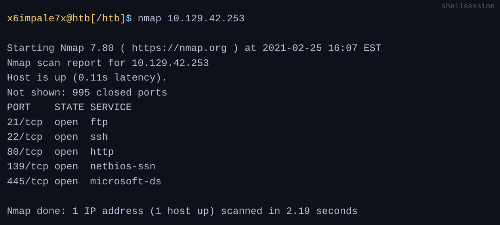

# Getting started

***

### Common Terms :

#### Shell :&#x20;

The shell is a program that takes the input from the user and passes these commands to OS (Operating System) to perform a specific function.

<figure><figcaption></figcaption></figure>

#### Port:

Ports are virtual points where network connections begin and end. They allow a computer to route different types of traffic simultaneously over a single network connection by mapping specific data streams to distinct software processes (e.g., SSH vs. web requests).



<figure><figcaption></figcaption></figure>

